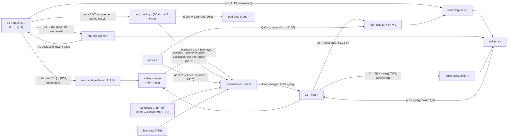

# Trade-off map - the P24 module and system, through A130, C06, D63, D64 and A120-A130

2026-10-03. Supersedes the 2026-10-01 scorecard (A92-A100), which is
kept as Appendix A.

**Purpose:**
- record every trade-off found so far;
- show how they connect into one loop, and which links are measured;
- say which way to move when a requirement or an assumed value
  changes.

**Every number comes from a registered experiment.**
- **Conditions,** unless a row says otherwise:
  - one P24 module (4 phases, 250 W, 48 V → 1 V);
  - Verilog RTL co-simulated with A88's plant (datasheet Coss(V),
    reverse conduction), 25 C;
  - statistics over the last 200 periods.
- **Losses:** D62's middle case on each run's measured waveforms.

**Words used here:**
- **lever:** a design value we choose;
- **constraint:** pass/fail;
- **objective:** better/worse;
- **the valley margin:** I_th − i_neg, the distance from the
  negative-current target to D57's zero-voltage threshold (phase 1's
  node).

## 0. In one paragraph

The design is pulled between switching loss and robustness by one
quantity, **the valley margin**:
- **Efficiency pushes i_neg up toward I_th.** The high side's hard
  turn-on loss falls to zero at I_th.
- **Transients push it down.** When a transient deepens a valley past
  I_th, the node clamps at the rail. The predictive turn-on then loses
  its target and the timing breaks down (A110 30%, A112 25%, A115).
- **The switching frequency sets I_th itself** (∝ V_rail √(C_node / L),
  L ∝ 1/f by Eq. (4)): 33.4 A at 5 MHz, 14.9 A at 1 MHz.
  - Lower f: zero voltage is cheap in ripple.
  - But the inductor's copper (∝ L) and the loop's sample delay (∝ 1/f)
    grow.
- **That closes the loop:**
  - the inductor technology decides whether a lower f pays;
  - the transient specification decides how much margin to keep;
  - the margin decides how close to I_th, and so how efficient, the
    design can run.

## 1. The levers

| # | lever | tried | current choice | evidence |
|---|---|---|---|---|
| L1 | **switching frequency / filter L** (Eq. (4), L ∝ 1/f) | 5 MHz, 1.4667 nH; 1 MHz, 7.333 nH | 5 MHz adopted; 1 MHz under test | A110, A115 |
| L2 | **negative-current target i_neg** (% of the 125 A peak) | 2-30% at 5 MHz; 5-12.5% at 1 MHz | 5% in the adopted design; best measured 20% (5 MHz), 10% (1 MHz) | D47, A110-A115 |
| L3 | **series capacitor Cs** | 0.6-8.7 µF (5 MHz); 15 µF (1 MHz) | 3 µF (5 MHz) | A107, A115 |
| L4 | **voltage-loop bandwidth** | I-only 7.5 kHz; PI 30-150 kHz | 100 kHz (5 MHz); 60 kHz (1 MHz) | A104, A115, A116 |
| L5 | **phase 1's low-side turn-off** | comparator (I1); timed dlo ±1 / ADM32 (I2); dlo feed-forward | I2 (ADM32) at 5 MHz; comparator (I1) at 1 MHz | A99, A100, A105, A113, A114, A116 |
| L6 | **slot rule, phases 2-4** | fixed; follow; 2-period average; `slot_lo`; valley trim | average + `slot_lo` | A92-A97, C02, A109 |
| L7 | **start-up sequence** | load at t = 0, handover, mode S Ton; input ramp ∝ √(L Cs) | A103's c1d | A103, A107, A115 |
| L8 | **modules and interleave** | 1-4 modules; T/16 grid | 4 modules, `slot_lo` (uniform T/16); final design: + `slave_floor` | C01-C06 |
| L9 | **node devices** (high + low side per phase) | 2 + 3 EPC2067 (P24 Table 3) | 2 + 3; P24 Sec. IV's 1 + 2 not run | D57 only |
| L10 | **auxiliary commutation branch** (extension) | Lr 0.75-1.25 nH | not adopted (extension) | A101, A102 |

**Environment, not levers:**
- the input slew (bus), A106 / A108;
- the load-step size;
- the inductor technology's R/L.

## 2. The design points, scored on one table

| metric | **5 MHz, 5%, I2** (adopted: A105/C02) | 5 MHz, 20%, I2 (A110/A112) | 5 MHz, 25%, comparator (A114 c25) | 1 MHz, 10%, I2, 60 kHz (A115) | 1 MHz, 10%, comparator, 60 kHz (A116 c60) | 1 MHz, 10%, I2 + floor, Cs 6 µF (A118 f6) | **2.5 MHz, 12.5%, I2 + floor, Cs 6 µF (A124, recommended)** |
|---|---|---|---|---|---|---|---|
| **valley margin** I_th − i_neg (at 43.2 / 48 V) | 27.1 A | 8.4 A | 2.1 A | 0.95 / **2.4 A** | 0.95 / 2.4 A | 0.95 / 2.4 A, but phase 1 held at the floor | **7.9 A** |
| high-side turn-on V_DS | 8.9-9.1 V | 2.2-3.0 V | −0.13-+0.88 V | 0.9-1.9 V | 0.85-1.86 V | 1.17-2.36 V | 3.26-3.93 V |
| hard turn-on loss | 8.93 W | 0.66 W | ~0 | 0.05 W | 0.04 W | 0.05 W | 0.66 W |
| **efficiency, D62 middle / ideal inductor** | 87.92 / 88.74% | **90.17 / 91.18%** | 90.15 / ~91.2% | 88.98 / **93.57%** | 88.97 / 93.57% | 88.97 / 93.57% | **90.61 / 92.51%** |
| inductor copper (middle R/L) | 2.64 W | 3.05 W | 3.23 W | **13.78 W** | 13.8 W | 13.8 W | 5.66 W |
| **ripple per phase, peak − valley** | 140.6 A | 177.3 A | 190.0 A | 152.7 A | 152.9 A | 153.7 A | 159.0 A |
| output current pk-pk (one module) | 100.9 A | 122.6 A | 133.7 A | 107.8 A | 108.2 A | 109.2 A | 110.0 A |
| Vo ripple (Co 4.672 mF) | 0.19 mV | 0.27 mV | 0.31 mV | 1.00 mV | 1.00 mV | 1.01 mV | 0.44 mV |
| ±62.5 A load step | +11.6 / −14.7 mV, ≤ 10 µs | within the 5% design's | ≤ 11 µs | −19.9 mV / 13.7 µs; **−62.5 A runs away** | +28.0 / −28.6 mV, 16 / 22 µs | +25.6 / −19.1 mV, 32 / 13 µs | **+15.9 / −12.0 mV, 6.6 / 3.6 µs** |
| −4.8 V / 1 µs | −18.5 mV | −25.7 mV, 75 µs | +15.8 mV, 2.8 µs | **runs away (495 A)** ✗ | +94 mV, 44 µs, **206 A** ✗ | +34.9 mV, 26 µs, **201 A** ✗ (by 1 A) | 216 A ✗; with vff + slope gate 174 A (A129) |
| +4.8 V / 1 µs, peak | 207 A ✗ | 199 A | **287 A ✗** | **runs away (546 A)** ✗ | **341 A** ✗, back in 52 µs | **206 A** ✗ (by 6 A), no runaway | 218 A ✗; with vff 182 A (A128/A129) |
| ±4.8 V / 5 µs, peak | - | - | - | - | 201 A ✗ (−4.8 V, A117) | **191 / 193 A** | 174 / **210 A** ✗; with vff + gate 174 / 175 A |
| turn-off sd, 30 ps jitter (0 ps) | 0.49-0.53 A | 0.36-0.48 A | 0.59-0.68 A | 0.13-0.16 A (0.00) | not run (0.11-0.12) | 0.14-0.17 A (0.00) | 0.23-0.27 A (0.01), A129 |
| start-up peak | 170 A | 170 A | 204 A ✗ | 158 A | 158 A | 157 A | 163 A |

**Notes:**
- **"I2":** A105's timed phase-1 turn-off; **"comparator":** A105's I1.
- **The 20% and 25% rows use the 100 kHz loop.**
- **The 5 MHz 5% row** is the reference for every "within" entry.
- **✗** marks a hard-constraint miss (peak > 200 A).

**Reading the table:**
1. **No column dominates.**
   - 5 MHz 20% is the best efficiency with today's inductor
     assumption, at a margin of 8.4 A.
   - 1 MHz 10% is the best with a low-R/L inductor and the lowest
     ripple for its turn-on voltage, but it has the smallest margin.
2. **Every column with margin ≤ 2.5 A fails a transient.**
   - With the timed turn-off: load decrease, falling line.
   - With the comparator: rising line.
   - At 1 MHz both directions of the 1 µs line step fail, because the
     ladder is also 5× slower (Cs 15 µF).
3. **The column with 8.4 A passes everything but the line-step edges
   (199-204 A).**
4. **At 1 MHz the timed turn-off with a comparator floor and Cs 6 µF
   (A118) is the candidate.**
   - It meets the load steps and the ±4.8 V steps over ≥ 5 µs at no
     steady-state cost.
   - The 1 µs steps miss by 1 and 6 A.
   - Three independent routes pointed to it before A118 ran: D63's map,
     A120's surrogate search, and A122's reinforcement learning.
   - **D64 then showed 1 MHz is not the efficiency optimum at P24's
     in-package scale. A124's 2.5 MHz design is better:** 90.61%, a
     7.9 A margin, load steps as at 5 MHz, falling line steps pass.
     Rising line steps faster than ~10 µs per 4.8 V remain open at every
     frequency (205-218 A).
   - **On the full standard matrix (A119)** the 1 MHz candidate passes:
     - every driver row (j30 sd 0.17 A, 0.01 over);
     - ±25 A; the 10 µs line steps.
     - **Misses:** −8 V / 10 µs at 205 A, and the 1 µs steps.
     - **At 40 V input the floor also removes the low-line limit cycle**
       (the target is past the threshold there).

## 3. The trade-offs

Status:
- **resolved:** a choice was made with data;
- **open:** measured, no choice yet;
- **estimate:** not yet measured.

Loop risk: whether fixing it tends to undo another.

| # | trade-off (lever) | gain ↔ cost, with evidence | status | loop risk |
|---|---|---|---|---|
| T1 | **Start-up starvation ↔ mid-band jitter** (L6) | A92 starves at m3n (827 A). A93 fixes it but doubles the two-cycle dither (×1.93). A97 removes the peak at 1.2-1.4× A92's mid-band jitter. | resolved: A97 (+ C02 `slot_lo`) | high if reopened (Appendix A) |
| T2 | **Early high-side turn-ons ↔ reverse conduction** (corrector gain) | A98 g/4: half the early turn-ons, P_rev 89 → 172 mW at 100 ps | resolved: gain 1/2 | medium |
| T3 | **Early-step size ↔ protection** | D53: smaller steps, more early turn-ons | resolved: 0.2 ns (×√5 at 1 MHz) | low |
| T4 | **Phases 2-4 period jitter ↔ phase 1's turn-off current** (L5) | A99/A100: phases 2-4 −24 to −38%; phase 1's spread 0.17 → 0.4-1.2 A | resolved for 5%: I2 (A105) | medium; see T13 |
| T5 | **Load-step tracking ↔ jitter** (dlo rule) | ADM32: tracking 19-23 → 1.4-1.7 A for +7-13% spread at 30 ps | resolved: ADM32 | coupled to T6, T13 |
| T6 | **Loop speed ↔ droop ↔ Ton dither ↔ stability** (L4) | A104: ±62.5 A from ±12% (I-only) to ±1.7% (100 kHz), dither 1-9 LSB, +6-15% spread. **At 1 MHz the ADC samples once per period:** 100 kHz gives a 53° margin and overflows the 16-bit ki, so 60 kHz is the ceiling (A115). **C09 (2.5 MHz, 4 modules):** one ADC code (0.5 mV) is a 5.69-LSB Ton kick; when the steady Vo sits at a ±0.25 mV decision level the loop cycles between adjacent Ton codes (turn-off current sd 0.11 A vs 0.01, Vo ±0.28 mV). Whether a run cycles depends on where the start-up leaves Vo in the code (C06 ls_p10, C08/C09 m3n); open, small (Vo within 0.03 %). | resolved at 5 MHz (100 kHz). **At 1 MHz: 60 kHz with the comparator** (A116). 30 kHz only turns the timed design's runaway into a 200 µs oscillation (H1), and costs ±48 mV against ±28 mV. | resolved; the loop is not the trigger |
| T7 | **Prediction ↔ reaction** (a pattern) | each predicted edge removes a comparator's noise, needs learning, and moves the error elsewhere | structural | - |
| **T8** | **High-side turn-on voltage ↔ circulating current ↔ ripple** (L2) | 5 MHz (A110): 5% → 20% saves 8.3 W of hard turn-on, costs +1.9 W of conduction and +26% ripple (140.6 → 177.3 A). The optimum is 20%: 90.17%. Zero voltage at 25%, +35% ripple. 1 MHz (A115): 10% gives 0.05 W at +8.6% ripple. | open: 20% robust at 5 MHz; 1 MHz pending A116 | feeds T12 |
| T9-T11 | **Auxiliary commutation branch** (extension) | saves 2.6-3.4 W net at 5% (A102); +10-12% switch area | open, outside the reproduction | `extensions/aux_commutation_branch/README.md` |
| **T12** | **Valley margin ↔ timing robustness** (L2 with L1) | **The unifying limit.** Margin ≤ 2.5 A fails transients: A112 p25 (2.1 A: −62.5 A step 183 µs, falling line 182 µs); A115 n10 (2.4 A: −62.5 A runaway, 554 A); A115 n12p5 (−0.6 A: ±45 mV oscillation until the turn-off is timed). Margin 8.4 A (A112 p20) passes except the line-step edges. Margin 27 A (5%) passes everything but +4.8 V / 1 µs. A111's zero-voltage valley measurement, a fix by measurement, is falsified. **A116 confirms the trigger (H1):** with a 30 kHz loop the timed design's valleys still reach −54 A; the loop's speed decides only between a runaway and a slow oscillation. A short ~3 A crossing (c60, +62.5 A) is tolerated. **The margin moves with the input** (D57: I_th 13.45 / 14.90 / 16.32 A at 43.2 / 48 / 52.8 V). The timed design needs more than ~1 A at the lowest input (t30 at 43.2 V: ±18 mV limit cycle); the comparator design does not. **A132 (L × C_node ±30%):** the margin scales with √(C/L) (D57, exact to 0.01 A): the fixed 15.625 A keeps 1.67 A at C −30% / L +30% (phase 4 −0.10 A) and wastes 0.43 points at C +30% / L −30%. A V_DS-comparator loop holding V_on 3.9 V reaches D57's depth in cosim (+22.5 codes, +0.36 points) but its deeper target costs +11-12 A on the +4.8 V rows (207 A): not adopted as built. | **open: the binding constraint** | **the loop closes here** (Section 4) |
| **T13** | **Timed ↔ comparator phase-1 turn-off in transients** (L5) | Mirror failures at large i_neg. Timed: phase 1's valley rises on falling steps and deepens on load decreases (A112, A115). Comparator: phase 1 stays at its boundary, stretches on rising steps, and the slotted phases follow its period (A114: 246-290 A). dlo feed-forward k = 11 fixes load steps but wrecks line steps (A113). | **1 MHz: resolved by the floor** (A118). The timed edge stays, and a comparator floor 2 A below the target stops phase 1's valley at −14.5 A. The load decrease and falling steps no longer break the timing (no floor: 671 A runaway, A118 t6). Found by D63, the A120 search and A122's RL; confirmed in the co-simulation. | **high:** fixing one direction breaks the other; needs an architecture change (each phase on its own boundary) or a slew limit |
| **T14** | **Switching frequency ↔ inductor ↔ loop** (L1) | 5 → 1 MHz (A115): switching losses 16.84 → 1.59 W; I_th 33.4 → 14.9 A; inductor copper 2.64 → 13.78 W (middle R/L); Vo ripple ×5 (Co unchanged); loop ceiling 100 → 60 kHz. **Break-even (D62, measured waveforms):** 1 MHz 10% beats 5 MHz 5% below 103 µΩ/nH (0.75 mΩ per phase at 7.33 nH), and 5 MHz 20% below 51 µΩ/nH (0.38 mΩ). | **resolved in the model by D64**, a first-principles stripline inductor: R_dc/L = 2ρ/(μ0 h t), R_ac/L = 2ρ/(μ0 h δ). At P24's in-package scale (≤ 2 cm² per phase, h ≤ 2 mm) the best frequency is **2-5 MHz, never 1 MHz** (1 MHz: 46-86%; best: 84.5-89.3%). 1 MHz wins only with a bulky inductor (~6 cm² × 4 mm per phase). The likely sweet spot is 2-3 MHz with a 10-15% target (margin 5-10 A). **D67:** that holds for an air-core with >= 1-2 cm² per phase; in Fig. 5's 0.25-0.63 cm² the air-core optimum is 5 MHz (2.5 MHz 2-9 points worse). The adopted 2.5 MHz rests on A124 with an MPC-class R/L (79 µΩ/nH), P24's own inductor family; the inductor technology is a question for Mihai. | medium; it redirects the frequency choice |
| **T15** | **Cs: switching quality ↔ ladder speed ↔ large-transient stability** (L3) | A107 at 5 MHz: 0.6 µF costs ~1 V of high-side turn-on (Q/Cs 1.8 V); 8.7 µF raises the start-up to 215 A and fast line steps to 244 A. The fix is a parameter: the input ramp ∝ √(L Cs). At 1 MHz, Cs ×5 keeps Q/Cs, but the ladder relaxes 5× slower (τ ∝ Cs). | resolved at 5 MHz: Q/Cs ≈ 3% of the rail, ramp ∝ √(L Cs). **Reopened at 1 MHz:** A116's 1 µs line steps fail in both directions while V_Cs1 takes ~15 µs to follow. **A117 at 1 MHz: 3 µF passes the fast line steps** (timed +4.8 V / 1 µs 188 A; comparator +4.8 V / 20 µs 174 A). The efficiency is unchanged, and the in-cycle ripple moves the turn-ons ±1 V. **A118: 6 µF is inside the window** (start-up 157 A; ±4.8 V / 5 µs 191 / 193 A with the floor; 15 µF reaches 211 / 241 A). **The 3 µF failure:** the 5× faster ladder couples with the loop in large fast transients: the handover oscillates ~1.1 ms to 517 A (not reproduced by D63: the in-cycle ripple is suspected), and a 5 µs rising step runs away with the comparator (D63 predicted it). So Cs has a window: too large, slow ladder; too small, unstable large transients. | **high at 1 MHz:** the window, and the handover's softness, are the next design variables |
| **T16** | **Slotted phases ↔ their own valley** (L6) | Phases 2-4 have no correction from their own current. Input drift costs phases 3-4 zero voltage (A108: falling ≥ 0.1 V/µs), and slaves' valleys float with R spread (C04: ±2.2 A). The per-phase valley trim of the slot is falsified (A109: the slot does not control the valley; it winds up). **C05-C06 (final design, 4 modules):** a slave's slotted phase 1 ran away after the handover (valley to −96 / −130 A, Ton to its cap; m1n / m3n / j100 failed); A118's floor on it (`slave_floor`) bounds it: 18/18 rows without overlap, ≤ 185 A; residual transient late fires (m1n 19, m3n 68). Phases 2-4 stay unfloored. **A132:** L +30% (with or without C −30%) leaves phases 2-4 in a ladder limit cycle (one module): rails 13.6 / 11.5 V, valleys −24 A at V_DS < 0, Vo ±6 mV, > 100 late fires, +4.8 V peaks 251 A, whatever the depth. **A133:** C06's floor on phases 2-4 is invalid in the ladder: a floored phase turns on inside the previous phase's high interval and the rails add (nominal +4.8 V / 5 us: 368 A; matrix 0/8 from the handover) - not adopted; it does not remove the cycle either. Without it the design holds L only within about -30 % / +10 %: L x 1.2 is bistable (balanced after start-up, s_p62 throws it into the cycle: 212 A, Vo -95 mV); D63 does not see the cycle. **A134-A137 (correction, 2026-10-04):** the "limit cycle" is a lock made by scb_vff's absolute phase-1 cap (A128, k = L0 x 180 A): when the steady Ton a load needs crosses it (s_p62 at L x 1.05-1.1, n0 at L x 1.3) phase 1 sits at the cap, rail 1 -> 16.5 V, the slotted phases saturate the loop, Vo -90 mV; D63 with the cap reproduces it, k = 0 or k x L/L0 removes it. With that cap the design held 200 A only at L0 (rising rows 206-214 A at L x 0.7-0.9, locked at 1.1). A133's L x 1.3 step rows were in phase 1's learning phase (timed at 818 us). A136's cap on Ton's low-pass (vff rel_q8 320, rel_lp 1; equal to A128's at L0, idle in steady state) holds L x 0.7-1.3 in operation (every A124 row <= 189 A, no lock; four modules at L x 1.2 lock with the old cap and hold with it, C08). Its handover regression (late fires, start-up peaks) is removed at L0 / L x 1.3 by restarting the low-passes at mode P (A137, seed 1; adopted by user decision, L x 0.7's handover stays mode S's). **C09:** with four modules the restart fixes the master only: the slaves enter mode P after the master's first ADC sample has kicked the broadcast Ton (1136 → 683) and seed there, lock ~35 µs (rail 1 13.8-15.4 V, peaks to 203.5 A); the four-module design keeps C06's absolute cap until C10 seeds every module independently of its entry time. **C10 (adopted by user decision, 2026-10-05):** every module seeds the low-pass with the Ton before mode P (vff seed 2): slave rail 1 <= 12.36 V on 18 rows, steady rows <= 180 A, post-step peaks within 4.2 A of C06 (max 188.7 A), single-module records unchanged (18/18); residuals: handover late fires m1n 25 / m3n 90 (C06 19 / 68), one late fire on s_m62 after the step. Four-module final design = C06 + vff {rel_q8 320, rel_lp 1, seed 2}. **C11:** it holds L x 1.2 / 1.3 with the handover inside the limits (rail 1 <= 12.87 V, <= 188 A, no lock; C08 without the restart reached 212.8 A at L x 1.2). **C12:** + A141's floor_late 1 on all 22 four-module rows: 0 floor-first duplicates, peaks <= 188.0 A, rail 1 <= 12.87 V; four-module final design = C10 + floor_late 1. **C13:** 30 random draws on C12 + lo_learn 4: no NEW events, all settle, rail 1 <= 12.53 V; one 11 ps floor-first tie (K5, harmless); > 200 A only on falling ramps outside A139's table (one module within 1-11 A). Four-module design frozen. | open (phases 2-4); slave phase 1 bounded by the floor; L+ cap lock closed in operation (A136); four-module handover lock closed (C10) | high: the same gap behind T13's comparator failure |
| **T17** | **Interleave ↔ slave valleys** (L8) | Uniform T/16 (C02) cuts the 16-phase output ripple ×5 pk-pk and ×7 rms. Slaves run at the master's timing, so ±10% L in a slave costs ±9% sharing and +0.5 V of turn-on, and stays soft-switched (C03). | resolved: `slot_lo`; ±10% L tolerated only for a larger-L module. **D66:** the smaller-L module binds the peak (+12-18 % loss at ±5 %; C14 co-simulation: ±5 % worst case 194 A, one module at −10 % 195 A, ±10 % worst case 208 A, so the 200 A crossing is near ±7 %; D66's transient was 2-7 A pessimistic); an i_neg trim (D61 B) drives its valley margin to ≤ 2.7 A, so sharing is an inductor-matching specification; final design (C06): ±10% L −8.8% sharing, low side −0.74 V; spread Cs ±20% / R ±30% / L ±5% (C07): ≤ 193 A, valleys ±1.7 A, floor needed (off: 265 A) but quiet in steady state; per-cycle spacing ≤ 0.05 ns steady but up to ~35 ns through steps (65 ns with the floor), back < 0.5 ns within 100-150 µs | low |
| **T18** | **Input slew ↔ peak and soft switching** (environment) | The 200 A limit holds from 2.4 V/µs rising; zero-voltage valleys need ≤ 0.24 V/µs rising, and falling fails even at 0.096 V/µs (A108). | open: needs the bus specification. At 1 MHz 4.8 V/µs fails every variant (A116); the tolerated slew is A117's question. | coupled to T13, T15 and T16 **Update (A126-A128, 2.5 MHz):** rising/falling line steps now close with a Vin sensor and the RTL feed-forward `scb_vff.v` (cfg "vff"; distilled 6-parameter rule from the anchored A127 policy): every A124 row <= 200 A (worst 188 A); +4.8 V 1/5 us 181.5/175.4 A, -4.8 V 1 us 175.5 A; steady state and loads unchanged, vff off bit-identical. **A129-A130 spec (gth 100, cosim):** <= 4.8 V steps >= 1 us (4.8 V/us); -8 V >= 6 us (1.33 V/us; 5 us = 208 A); +8 V >= 10 us (0.8 V/us, 198 A marginal). **Cost:** -8 V/10 us peak 168.5 -> 188.2 A, Vo -28 -> +38 mV (the registered no-harm Vo criterion misses; +4.8 V/5 us by 0.2 mV). The bus-slew spec (>= 5 us) stays. **A138-A139 (GP map over L / Cs x 0.7-1.3, cosim-verified):** the peak is not monotone in slew - falling -4.8 V peaks at 2-4 us (192.2 A at 2.3 us, L x 0.9 / Cs x 1.05, vs 173.5 A at 1 us nominal), rising steps at L x 0.7 grow with slower slew (+4.8 V: 205.9 A at 20 us) - so the bus needs a slew window or a design fix, not a minimum slew; A139's 95 % table names the certified cells. **A140 (why):** falling = the slope gate shutting (-4.8 V: 162 A at 2 us open, 192 A at 2.5 us shut); gth 50 flattens -4.8 V but raises -6.4 V to 214 A and L x 1.3 -8 V/10 us to 198 A, so gth stays 100 and the falling spec is windows; rising = mostly a duplicate phase-1 turn-on restarting the Ton timer (+20-38 A; L x 0.7 +4.8 V <= 194 A without it) - an RTL defect (A141), not a slew trend. **A141:** the floor's late report (cfg floor_late 1) removes it: L x 0.7 +4.8 V <= 191.6 A at 1-40 us (rising spec open), +8 V 210.1 A at 20 us / 182.1 A at 50 us; adopted on one module and, by C12, on four modules. A126's PPO gamed the reward (invalid). **A129:** a latched Vin-slope gate (cfg vff "gth", 2 V) removes that cost (−8 V/10 us 170.9 A, |Vo| 28.6 mV) and keeps −4.8 V/1 us at 173.6 A; the standard matrix passes with and without it. Adopted: steps ≤ 4.8 V close at any tested slew ≥ 1 us; −8 V/5 us is 208 A (gate closed, as without feed-forward), so 8 V falls still need ≥ 10 us. **A134-A136:** the phase-1 cap's k was fixed at L0 and locks the ladder at L > L0 (T16); A136 replaces it with the relative cap on Ton's low-pass (same value at L0): +4.8 V rows 181 / 177 A at L0, <= 189 A at L x 0.7-1.3; +8 V / 10 us 194 A at L0 (A128's 198 A). **A142 (random stimuli):** the certified rising cells hold only in timed mode; in the mode-P comparator phase (the first 0.4-0.7 ms after the handover) a rising step at 4-5 us oscillates (+4.8 V nominal: 254 / 247 A; +6.4 V: 388 A). **A143:** lo_learn 1024 -> 4 ends the comparator phase ~1.5 us after the handover: those rows 176-196 A, handover better, matrix and four modules within noise; the floor sits 2-4.5 A deeper (trim not converged). The certified rising cells now hold from ~2 us after the handover. |
| **T19** | **Package copper ↔ loss** (package layer) | D65: Fig. 5 routes every phase sideways to one central Vo / GND strip; one 35 µm layer each costs 30.7 W per 250 W module (12.3 %, more than the converter's 25.9 W); 1 / 2 / 5 % needs 429 / 215 / 86 µm per stack. Vias, strip, Cs ESR ≤ 0.5 mΩ: < ~1 % together | open: needs the package's copper stack or a vertical output (Mihai); D65 | low: efficiency only |
| **T20** | **Commutation loop ↔ switch voltage** (package layer) | D65 energy bound: high-side turn-off at 143 A allows ≤ 141 pH for 40 V (91 pH at 80 %), at 200 A 72 pH, C13's 260 A falling ramp 37 pH; published embedded-GaN loops 230-320 pH ; A144 (plant, Q 7): steady SH1 17 / 27 / 34 / 52 V at 50 / 100 / 150 / 300 pH, but a hard turn-on of phase k-1 rings SH_k to 24 + 1.7 dV regardless of L (start-up 46-47 V, +4.8 V / 1 us 57-58.5 V); loop energy 7.7 W per 100 pH (1 % -> ~30 pH) | A144: controller holds at Q 7 up to 300 pH, fails undamped; voltage fails at every L with instantaneous edges. A145 (1-2 ns edges): still fails at every L (best 50 pH / 2 ns 41.8 V after +4.8 V / 1 us), steady <= 33.9 V to 150 pH; measured loop loss 1.4 / 3.8 / 6.4 W at 50 / 100 / 150 pH -> 1 % at ~70 pH; edges alone 1.2 / 2.7 W; hard-turn-on overshoot is a control problem; D65, A144, A145 | high: loop Q decides the comparators; hard turn-ons (T12 margin) set SH2-4's voltage |

## 4. The loop

**The two feedbacks that close it:**
1. **Efficiency ↔ robustness through i_neg:**
   - efficiency pushes i_neg toward I_th;
   - robustness keeps a margin below it.
   - The two meet at i_neg = I_th − (worst transient valley excursion).
2. **Frequency through the inductor and the loop:**
   - a lower f lowers I_th (zero voltage at low ripple) and the
     switching loss;
   - it raises the copper and lowers the loop's ceiling, which raises
     the droop and changes the transient excursion that sets the
     margin.

**What closes the loop numerically, and what does not yet:**

| link | status |
|---|---|
| f → I_th | **measured.** D57 against the co-simulation: phases 1-3 within 0.2 V at 5 MHz (A110); every phase within 0.23 V of its own node at 1 MHz (A115). |
| i_neg → turn-on V, ripple, conduction | **measured** (A110, A115) |
| f → switching loss | **measured** (A115) |
| f → copper | **modelled.** D62 with an assumed R/L; the R/L itself is open. |
| f → loop ceiling → droop | **measured.** With the comparator, D59 is exact within 4% at 1 MHz (A116). With the timed turn-off the extremes are ~30% smaller: its frozen interval adds gain (A115). |
| margin → transient robustness | **measured, and now modelled (D63, the cycle-by-cycle valley map).** D63's peaks are within 10% on 11 co-simulated line and load steps (A116, A117), and it reproduces every load step with the comparator. Its outcome rule is refitted on 10 phase-1 crossings: slow or runaway when the crossing is deeper than ~12 A for ~25 periods or more (fitted, to be tested). **Its weak domain:** the timed 60 kHz design on 1 µs steps (the controller's learning loops). |
| Cs → ladder → line-step excursion | **measured and modelled at 1 MHz** (A116, A117, D63). 15 µF: slow ladder, line-step peaks. 3 µF: line steps pass (timed +4.8 V / 1 µs 188 A), but the handover oscillates (517 A). The window between is mapped by D63 next. |
| bus slew → robustness | measured at 1 MHz (A117). The comparator at 15 µF fails rising steps up to 50 µs: phase 1 stretches with its rail, not a slew effect. Timed falling steps are slow until ~50 µs. |

**The loop is now closed in structure and in every link.** The last
link, the transient valley excursion, is D63
(`symbolic_derivations/03_P24_native/D63_P24_VALLEY_MAP.md`): a
self-built, cycle-by-cycle model validated against 37 co-simulated
transients.
- **What it does:** it maps the design space before any run.
  - Its peak current is trusted to ~10%.
  - Its crossing rule is a fitted indicator.
- **One domain still needs the co-simulation:** the timed 60 kHz design
  on fast line steps.

## 5. How every change is scored from now on

1. **The standard matrix** (`scb_ivr.cosim.matrix.ROWS`), the same for
   every candidate:
   - n0;
   - driver mismatch m ±1 and ±3.4 ns;
   - jitter 30 and 100 ps;
   - load steps ±25 and ±62.5 A;
   - line steps ±4.8 V over 1 and 10 µs, and −8 V over 10 µs.
   - **At 1 MHz:** the step times ×5; the line-step slews stay physical
     (the bus does not change with the converter).
2. **Hard constraints** (pass/fail):
   - no cross-conduction;
   - peaks ≤ 200 A, the start-up included;
   - the low side at zero voltage in steady state;
   - every step recovers (`step_stats` finite).
3. **Objectives,** scored on Section 2's rows:
   - efficiency (D62 middle and ideal inductor);
   - ripple (per phase, output current, Vo);
   - load-step and line-step extremes and recovery;
   - jitter spread;
   - start-up;
   - RTL size.
4. **Report the valley margin** (I_th − i_neg, D57) with every design.
   A margin below ~2.5 A is a known failure region (T12).
5. **The mathematical model maps the curve before a choice** (D57,
   D58, D59, D62). One point is then chosen, with the weights.
6. **The acceptance gate** (`scripts/acceptance.py`) holds every
   registered criterion. Each miss is documented in its RESULTS.
7. **Registered bands are conformal** (A125, from the next experiment
   on): D63's point prediction with the Mondrian and signed 80% bands
   calibrated on every registered row so far (`register_band`). The
   recovery time gets a log band (D63 is good to ×3), the Vo extreme
   both excursions.

## 6. Decisions needed (priorities)

For the user and Mihai. Each one moves the design along a different
trade-off.
1. **The inductor technology (T14).** It decides the frequency.
   - **Below ~51 µΩ/nH** (0.38 mΩ per phase at 7.33 nH): 1 MHz wins
     outright.
   - **Above ~103 µΩ/nH:** stay at 5 MHz.
   - In between: 1 MHz beats the 5% design but not 20%.
   - **For scale:** D62's middle case is 79 µΩ/nH (an MPC core).
     P24 Table 2's embedded inductors are 4000-5800 µΩ/nH, far worse at
     both frequencies.
2. **The transient specification (T12, T18).**
   - The largest load step and its slew; the bus slew rate.
   - These fix the valley margin to keep, and so how close to zero
     voltage the design may run.
3. **The voltage-loop bandwidth (T6).**
   - 5 MHz: 60 kHz (no spread cost), 100 kHz (adopted) or 150 kHz.
   - 1 MHz: 60 kHz, the ceiling. A116: 30 kHz does not fix the
     transients and doubles the droop.
4. **Phase 1's turn-off (T13).**
   - Timed: robust to rising steps (5 MHz).
   - Comparator: robust to falling steps and load decreases. Needed at
     1 MHz (A116).
   - Or the architecture change.
5. **The complexity budget.**
   - A100 is +9% cells over A97; the PI +5.8%.
6. **The auxiliary branch.** An extension: its own README, Section 3.

## 7. Which way to move (rules for later adjustment)

| if this changes | move | because |
|---|---|---|
| the inductor's footprint per phase is fixed (in-package) | D64: ≤ 0.5 cm² → 5 MHz; 1-2 cm² → 2-3 MHz with a 10-15% target; never 1 MHz below ~6 cm² | T14 (D64) |
| a bulky off-package inductor is allowed (h·t ≳ 0.5 mm², ~6 cm² per phase) | toward 1-1.5 MHz, i_neg 7.5-10% with the floor (A118) | T14 (D64) |
| only high-R/L inductors | 5 MHz, i_neg 15-20% | T8 optimum; margin 8-14 A |
| the transient specification tightens | lower i_neg (more margin), or the comparator turn-off plus a bus slew limit | T12, T13 |
| the timed turn-off is kept | keep the margin above ~1 A at the lowest input voltage (I_th ∝ the rail) | T12 (A116 t30 at 43.2 V) |
| a bus slew of ≥ 5 µs can be specified | at 1 MHz: the floor with Cs 6 µF, **confirmed in the co-simulation** (A118: every load and ±4.8 V / ≥ 5 µs step within 200 A) | T13, T15, T18 (A118, A120) |
| fast line steps must be met at 1 MHz | a Cs inside the window (between 3 and 15 µF: D63 maps the line steps, the co-simulation the handover), with a softer handover; and the floor turn-off for the falling steps. A slew limit alone does not save the comparator's rising steps (A117: 225 A at 50 µs). | T13, T15, T18 |
| the bus slew is limited to ≲ 2.4 V/µs | the +4.8 V / 1 µs peak stops binding | T18 |
| Co may grow | the droop at the 1 MHz loop ceiling falls ∝ 1/Co | T6 |
| a smaller node (P24 Sec. IV's 1 + 2 devices) | I_th falls (D57: 9.5-12.8% at 1 MHz), so the margin grows at the same i_neg | T12; not yet run |
| a hotter junction (125 C) | R_on ×1.59 (A90): conduction grows, so the optimum i_neg moves down | T8 |
| the gate drivers' high-to-low mismatch can exceed the node's fall (~1-2 ns) | budget ~0.25 points per ns at 1 MHz: +3.4 ns cost 0.85 points (A119 m3p) | driver (A91, A119) |
| more modules | interleave per C02; slaves tolerate ±10% L; the final design needs the slave floor (C06) | T16, T17 |

## 8. Not yet known

- **The transient valley-excursion model** (Section 4's open link).
- **At 1 MHz:**
  - the candidate's last misses (1 µs steps, −8 V / 10 µs: 1-6 A over 200 A): floor depth, fc up to ~68 kHz, a line-dependent target;
  - four modules at 1 MHz with the candidate (superseded: the final 2.5 MHz design runs on four modules, C05-C06);
  - the floor depth (2 A, not optimised) and the load-decrease recovery (32-47 µs, slower than D63's 18 µs);
  - the neighbourhood of the candidate (A121's 8 proposed runs);
  - D63's refitted outcome rule, registered and tested;
  - the standard matrix beyond A116's rows (m, j30 / j100 for c60,
    ±25 A, the 10 µs and −8 V line steps);
  - temperature.
- **The 13.44 nH (Table I) point**, which runs at ~0.5 MHz.
- **P24 Sec. IV's node** (1 + 2 devices).
- **Coss spread and per-module driver delay** (C04 Section 3).
- **Losses not modelled:** Coss hysteresis, AC resistance, core loss,
  driver quiescent power, output-capacitor ESR.

## 中文摘要

**一句话：** 所有 trade-off 最后都汇到一个量上，就是**谷底裕量**（I_th − i_neg）：负电流目标离 ZVS 门槛还差多少安培。

**闭环怎么形成：**
1. **效率往上推 i_neg：** 越接近门槛，高侧硬开通损耗越小。
2. **瞬态往下压 i_neg：** 瞬态一旦把谷底推过门槛，节点被钳在轨电压上，预测开通失去目标，时序就会崩。
   - 实测：裕量 ≤2.5 A 的设计都在某个瞬态上失败（A112 25%、A115 10%）。
   - 裕量 8.4 A（5 MHz 20%）只在线电压阶跃的边缘出问题。
3. **频率决定门槛本身：** 5 MHz 时 33.4 A，1 MHz 时 14.9 A。
   - 降频：ZVS 更便宜，纹波小。
   - 代价：电感铜损按 L 增长，电压环的采样延迟变长。
   - 所以降频值不值，看电感的 R/L：
     - < 51 µΩ/nH：1 MHz 全面胜出；
     - > 103 µΩ/nH：留在 5 MHz。

**A116 证实了这个机理：**
- 把电压环降到 30 kHz，定时关断的谷底仍被推到 −54 A，只是从失控变成 200 µs 的慢振荡。所以根源是越过门槛，环路快慢不是触发点。
- 比较器关断（c60）在 1 MHz 下修好了负载阶跃（+28/−28.6 mV，16/22 µs），稳态零代价。它是 1 MHz 的暂定控制器。
- **但 1 µs 的 ±4.8 V 线电压阶跃，所有变体都过不了 200 A**（c60 是 341/206 A，不过都能在约 50 µs 内恢复）。原因是 Cs 放大到 15 µF 后，阶梯分压慢了 5 倍。
- 裕量还随输入电压变化：43.2 V 时只剩 0.95 A，定时关断会持续振荡，比较器关断不会。

**闭环里还没量化的一环：** 瞬态时谷底会偏多少（取决于关断方式、电压环、阶梯速度），还需要一个小模型。

**闭环最后一环也补上了（D63，自建的逐周期谷底模型）：**
- 用 37 个 cosim 瞬态验证过，峰值电流误差在约 10% 以内。
- A117 用它事先登记的预测检验：峰值全中；结局分类规则判错 6 行，已按 10 个越界案例重新拟合，下次先登记再检验。
- 它的盲区是定时关断 + 60 kHz 下的快阶跃。

**A117 新发现：** Cs 有一个窗口。
- 15 µF：阶梯太慢，线电压阶跃峰值高；
- 3 µF：线电压阶跃过了（定时关断 +4.8 V/1 µs 188 A），但交接时振荡到 517 A。

**A118 确认了 1 MHz 的候选设计：** 定时关断 + 2 A 比较器地板 + Cs 6 µF。
- 负载阶跃，以及压摆 ≥5 µs 的 ±4.8 V 线电压阶跃，峰值全部在 200 A 以内；
- 启动 157 A，效率 88.97%；
- 1 µs 的快阶跃只超 1–6 A。

这个方案先后由三条独立路径找到：D63 的设计图、神经网络代理模型的搜索（A120）、强化学习（A122）。然后 cosim 证实。

**A119：候选设计跑完了整个标准矩阵。**
- 驱动失配、抖动、±25 A、10 µs 的线电压阶跃都通过；
- 剩下 −8 V/10 µs（205 A）和 1 µs 快阶跃（201/206 A）各超几安培；
- 输入降到 40 V 时，地板还消除了低输入下的极限环。

**下一步：**
1. 用地板深度、电压环带宽（最高约 68 kHz）把最后几安培压下来；
2. 1 MHz 的四模块系统。

**D64（电感的第一性原理模型）把“频率选哪个”这一环也闭上了：**
- 用平行板空心电感推出 R/L = 2ρ/(μ0·h·t)，只取决于电感高度和铜厚。
- 在 P24 那种封装内集成的尺度（每相 ≤2 cm²、高度 ≤2 mm）下，最优频率是 2–5 MHz，1 MHz 一次都不是最优。
- 1 MHz 要胜出，电感得做到每相约 6 cm²、4 mm 高，那就不是集成方案了。
- 最可能的甜点：2–3 MHz、负电流 10–15%，离 ZVS 门槛还有 5–10 A 的裕量，瞬态比 1 MHz 更好处理。

**A124（2.5 MHz、负电流 12.5%）验证了 D64 的方向：**
- 效率 90.61%，是项目里最高的（5 MHz 最优 90.17%，1 MHz 候选 88.97%）；
- 离 ZVS 门槛 7.9 A，负载阶跃和 5 MHz 一样好，下降的线电压阶跃都通过；
- 剩下的是上升的快线电压阶跃（5 µs 内 +4.8 V 时 210 A），这一条在每个频率下都存在，靠母线压摆规格、更小的 Cs 或输入前馈解决。

**以后怎么调：** 先定两件事，其余跟着走。
1. **电感工艺：** 决定选哪个频率。
2. **瞬态指标：** 负载阶跃大小，母线压摆率。决定要留多少裕量。

## Appendix A. The A92-A100 controller scorecard (2026-10-01)

Kept as the record of T1-T5. Conditions: 5 MHz, 5% (−6.25 A), ~250 A
resistive load, last 200 cycles; I-only voltage loop (before A104).

**Its Section 0 found** that the high side turns on at its resonance
valley (~9 V of 12 V), not at zero voltage. That loss was larger than
every loss the A92-A100 changes moved, which led to T8 and
A110-A116.

### A.1 The designs

| design | what it changed | status |
|---|---|---|
| **A92** | error-based correctors (94 ps targets, gain 1/2), fixed slots | was adopted |
| **A93** | slots follow the last period (T/nP) | not adopted |
| **A97** | slots from the two-period average, with the missed-slot guard | adopted (the slot rule today) |
| A98 g4 | A97 with corrector gain 1/4 | not adopted |
| A99 | A97 with phase 1's turn-off timed, dlo ±1 LSB | not adopted |
| **A100** | A99 with an adaptive dlo step (cap 32 LSB) | adopted as A105's I2 |

### A.2 The scorecard

**Hard constraints:** no cross-conduction, peaks ≤ 200 A. Every design
listed meets them in every run made.

| metric | A92 | A93 | **A97** | A98 g4 | A99 | **A100** |
|---|---|---|---|---|---|---|
| **start-up:** peak current at m = -3.4 ns (handover) | **827 A** | 172 A | 156 A | - | 156 A¹ | 156 A¹ |
| **steady state:** windowed dither, no jitter | 0.49 A | 1.31 A | 0.57 A | - | **0.04 A** | **0.04 A**² |
| turn-off current spread, phases 2-4, no jitter | 0.16-0.17 A | 0.28-0.55 A | 0.18-0.21 A | - | **0.018 A** | **0.021 A**² |
| **30 ps jitter:** spread, phases 2-4 | 0.52-0.61 A | 0.71-0.98 A | 0.56-0.66 A | 0.56-0.62 A | **0.39-0.42 A** | 0.42-0.47 A |
| 30 ps: period spread | 0.60 ns | 0.57 ns | 0.59 ns | 0.59 ns | **0.19 ns** | 0.37 ns |
| 30 ps: high-side turn-ons before the valley, phases 2-4 | 21-27% | 29-37% | 22-26% | **12-16%** | 16-18% | 17-18% |
| **100 ps jitter:** spread, phases 2-4 | 1.39-1.61 A | 1.95-2.69 A | 1.59-1.79 A | 1.65-1.88 A | **1.02-1.16 A** | 1.03-1.20 A |
| 100 ps: reverse-conduction loss P_rev | 91 mW | 89 mW | 89 mW | **172 mW** | 74 mW | 74 mW |
| 100 ps: early low-side turn-on loss (A91's estimate) | 31-102 mW | 30-102 mW | 31-102 mW | **12-39 mW** | 30-99 mW | 30-99 mW |
| **phase 1's own turn-off current spread**, 30 / 100 ps | **0.17 / 0.19 A** | 0.17 / 0.19 A | 0.17 / 0.19 A | 0.17 / 0.19 A | 0.39 / 1.13 A | 0.43 / 1.16 A |
| **load steps ±25 A / ±62.5 A:** phase 1's largest turn-off current deviation | (comparator: 0.37 A) | - | 0.37 A | - | **19-23 A** (±62.5 A) | 0.6-0.7 / 1.4-1.7 A |
| load steps: Vo excursion ±25 A / ±62.5 A (I-only loop) | - | - | 50 / 122-127 mV | - | 83-103 mV³ | 49-50 / 120-126 mV |
| **driver mismatch m = ±1, +3.4 ns** | tolerated | tolerated | tolerated | - | not tested | not tested |
| **RTL size** (cells) | 38 456 | 39 571 | 40 296 | 40 296 | 41 605 | 43 924 |

**Notes:**
1. Bit-identical to A97 before phase 1's switch to timed mode (A99's
   gate).
2. From the 300-400 µs interval of A100's step runs, before the step and
   without jitter.
3. Smaller only because phase 1 runs far from its operating point
   (turn-off current +16.9 / −24.9 A).

### A.3 Real improvements and trades (D53/D54)

**Phase 4's turn-off current per unit edge jitter, ratio to A97,
against frequency:**

| ω/π | 0.12 | 0.25 | 0.33 | 0.5 | 0.67 | 0.75 | 1 |
|---|---:|---:|---:|---:|---:|---:|---:|
| A92 fixed slots | 0.93 | 0.82 | 0.76 | **0.71** | 0.76 | 0.82 | 1.00 |
| A93 follow slots | 0.98 | 0.96 | 0.97 | 1.07 | 1.29 | 1.45 | **1.93** |
| A99 timed phase 1 | 0.74 | 0.63 | 0.58 | **0.54** | 0.57 | 0.61 | 0.74 |

- **A move along the curve** (the slot rule, A92 → A93 → A97) shifts
  gain between bands. Bode's sensitivity integral limits it.
- **A structural change lowers the whole curve.** A99's timed turn-off
  removes phase 1's comparator amplification (×10.5); its costs appear
  in other metrics (T4, T13).
